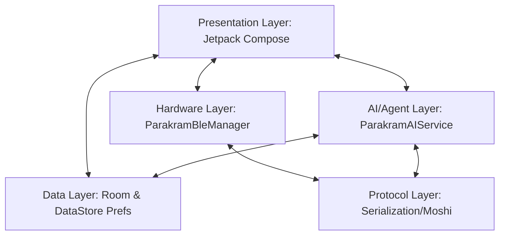

# Parakram Android Companion OS 🚀

Parakram is an AI-native operating layer and real-time dashboard for high-performance hardware orchestration and embedded diagnostics. It bridges the gap between digital models (LLMs) and physical microcontrollers, enabling developers, designers, and students to prototype responsive cyber-physical systems using Jetpack Compose and natural language orchestration.

Built using **Kotlin, Jetpack Compose, Room DB, Datastore, and the Gemini 3.5 Flash / Gemma REST API**, the application establishes an autonomous loop: interpreting natural language inputs, compiling hardware-matching directives, sending commands across Bluetooth Low Energy (BLE), and visually graphing telemetry data streams.

---

## 🛠 Project Architecture & Layers

Parakram uses a highly optimized state-driven architecture aligned with modern Android development patterns. The workflow is segregated into modular layers, preventing tight coupling of hardware-dependent APIs and visual presentation states.



The system features eight critical layers outlined in developer documentation:
1. **Presentation Layer**: Custom dynamic Material 3 dark-theme user interface running on top of modern components (flows, bottom navigation bar, floating glowing action buttons).
2. **Domain/Core Logic**: Repository patterns and clean flow synchronization governing task routing, persona customization, and state states.
3. **Data Layer**: Room SQLite persistence engine for logs/charts and DataStore Preferences for configurations and settings.
4. **Hardware Layer (`TinkrBleManager`)**: Samsung/Xiaomi customized Bluetooth Low Energy state-engine with automated MTU negotiating capabilities and GATT caching.
5. **AI/Agent Layer (`TinkrAIService`)**: Autonomous reflective execution loops utilizing cloud-hosted Gemini and local models (simulated Gemma 4 E2B runtime).
6. **Firmware Layer**: Integrated ESP32-S3 software routines, over-the-air (OTA) updates, and boot structures.
7. **Protocol Layer (`TinkrProtocol`)**: Clean JSON serializations defining data shapes, pin mapping schemas, and message packets.
8. **Hardware Sandbox Emulator**: Local companion sensor decays and fluctuating digital-twin mock simulators designed to enable testing without physical hardware.

---

## 📂 Codebase Directory Mappings

The source directory of the Parakram application is structured logically to simplify maintenance and ensure scalability:

```text
/app/src/main/java/com/example/
├── MainActivity.kt               # Central application bootstrap, screen routing, and UI sheet container
├── ai/
│   └── TinkrAIService.kt         # Tool-annotation definitions, reflective executing pipelines, and Gemini interfaces
├── data/
│   ├── SettingsRepository.kt     # Datastore preferences for translation codes, developer personas, and simulators
│   └── TinkrDatabase.kt          # Room persistence database for hardware logs, boards lists, projects, and conversations
├── hardware/
│   └── TinkrBleManager.kt        # Real BLE scanners, Samsung/Xiaomi caching optimizations, and virtual physical twin loop
├── protocol/
│   └── TinkrProtocol.kt          # Serializing adapters for sensors stream, hardware capability models, and command sheets
└── ui/
    ├── AISheet.kt                # Sliding floating AI terminal sheet with active prompt running environments
    ├── BoardsScreen.kt           # BLE peripheral cataloging, network Wi-Fi provisioning, and custom hardware logs
    ├── BuildScreen.kt            # Code editor terminal, interactive blockly visualizers, voice control, and canvas
    ├── HomeScreen.kt             # Responsive Material 3 instrumentation panels, active logs feeding, and control buttons
    ├── OnboardingScreen.kt       # Multi-step multilingual guide configuring preferences, local weights, and BLE boards
    ├── ProjectsScreen.kt         # Project sandbox templates manager (Smart Planter, Smart Greenhouse, custom sketches)
    ├── TinkrTranslations.kt      # Localization dictionary mapping commands across Spanish, English, French & German
    └── theme/
        ├── Color.kt              # Slate-gray, warning amber, and high-visibility digital-glow orange values
        ├── Theme.kt              # Central MaterialTheme system wrapping edge-to-edge layouts
        └── Type.kt               # Type scales pairings matching display-grotesque headers with code monospaces
```

---

## 📖 Comprehensive Specialized Documentation

To learn more about the engineering details of Parakram, consult the following directories:

*   **[Core Architecture Deep Dive (`/docs/ARCHITECTURE.md`)](/docs/ARCHITECTURE.md)**: Explains the internal mechanics of the 8 core layers, state synchronization flows, and localized translations dictionary.
*   **[Data & Domain API Reference (`/docs/API_REFERENCE.md`)](/docs/API_REFERENCE.md)**: Full API document for maintaining DAOs, schemas, local databases, preference flows, and underlying entity states.
*   **[AI Agent & Autonomous Tools (`/docs/AI_INTEGRATION.md`)](/docs/AI_INTEGRATION.md)**: Details the `@Tool` and `@ToolParam` reflective bindings, recursive planning loops, local Gemma fallback, and Gemini API bindings.
*   **[BLE Hardware Cores (`/docs/HARDWARE_INTEGRATION.md`)](/docs/HARDWARE_INTEGRATION.md)**: Thorough explanations of GATT optimizations, data stream parsing, connection states, and client-side firmware simulations.

---

## 🚀 Rapid-Start Guide for Contributors

Follow these steps to build and run Parakram locally or test implementation changes inside the sandbox workspace.

### 1. Configure the Gemini API Key
Parakram supports both local simulated reasoning and cloud intelligence. To activate the cloud model:
1. Obtain an API key from Google AI Studio.
2. In the AI Studio platform interface, add `GEMINI_API_KEY` to your environment secrets.
3. The application will automatically pick it up via `BuildConfig.GEMINI_API_KEY` and swap from local mock intelligence to live cloud-hosted execution.

### 2. Standard Gradle Tasks
Use the following commands inside the applet directory for testing and compilation:

*   **Build the Application APK**:
    ```bash
    gradle assembleDebug
    ```
*   **Run Local Unit or Robolectric Tests**:
    ```bash
    gradle :app:testDebugUnitTest
    ```
*   **Verify Screenshot Layout Layouts (Roborazzi)**:
    ```bash
    gradle :app:verifyRoborazziDebug
    ```
*   **Record Fresh Reference Screenshot Baseline**:
    ```bash
    gradle :app:recordRoborazziDebug
    ```

---

## 🎛 Local Sandbox Emulator (No Hardware Required!)

Parakram has a built-in IoT hardware simulator running inside `TinkrBleManager`. If no real ESP32 microcontroller is paired:
1. Toggle **Simulator Mode** on in the Onboarding screen or the Boards manager.
2. The manager automatically spins up a background coroutine loop simulating **Ambient Temperature (°C)**, **Soil Moisture (%)**, **Ambient Light (lx)**, and **Air Quality (CO2 ppm)**.
3. It simulates natural log decay (e.g., soil dehydrating slowly) and active reactive cycles (e.g., triggers to Pin 12 Relay spike moisture levels mimicking water pump operations).
4. Physical output mappings (Pin 13 Debug Status LED, ST7789 TFT LCD buffer, servo motors at Pin 15) render states directly on client screens for testing.

---

*Parakram Companion Operating System is created and optimized for fast-paced cybernetic exploration. For questions, reach out to the project maintenance team.*
