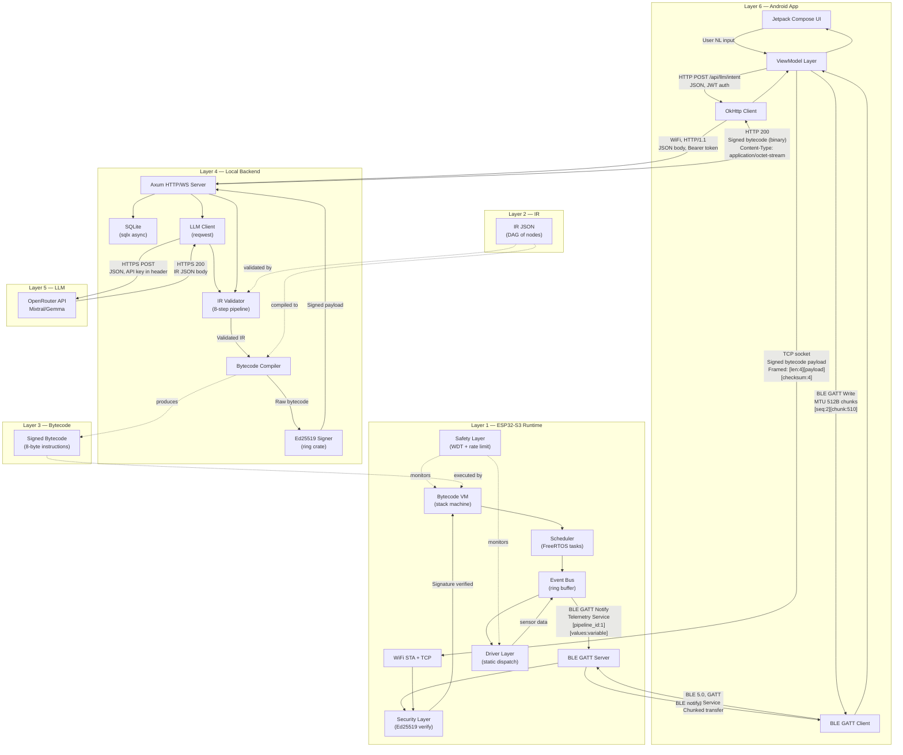
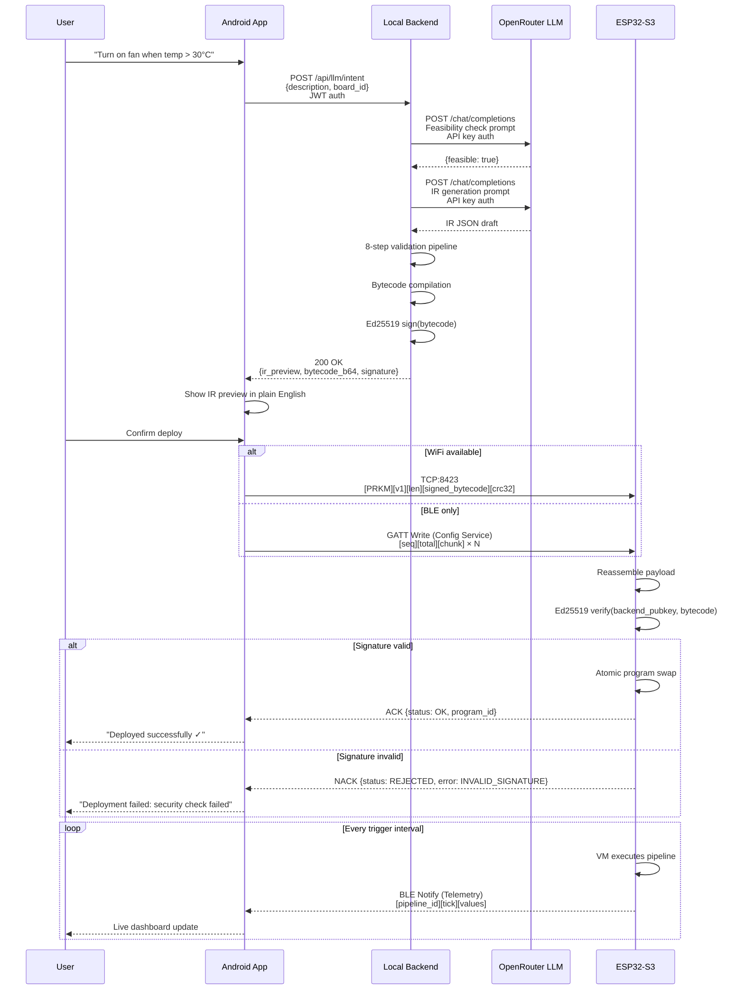
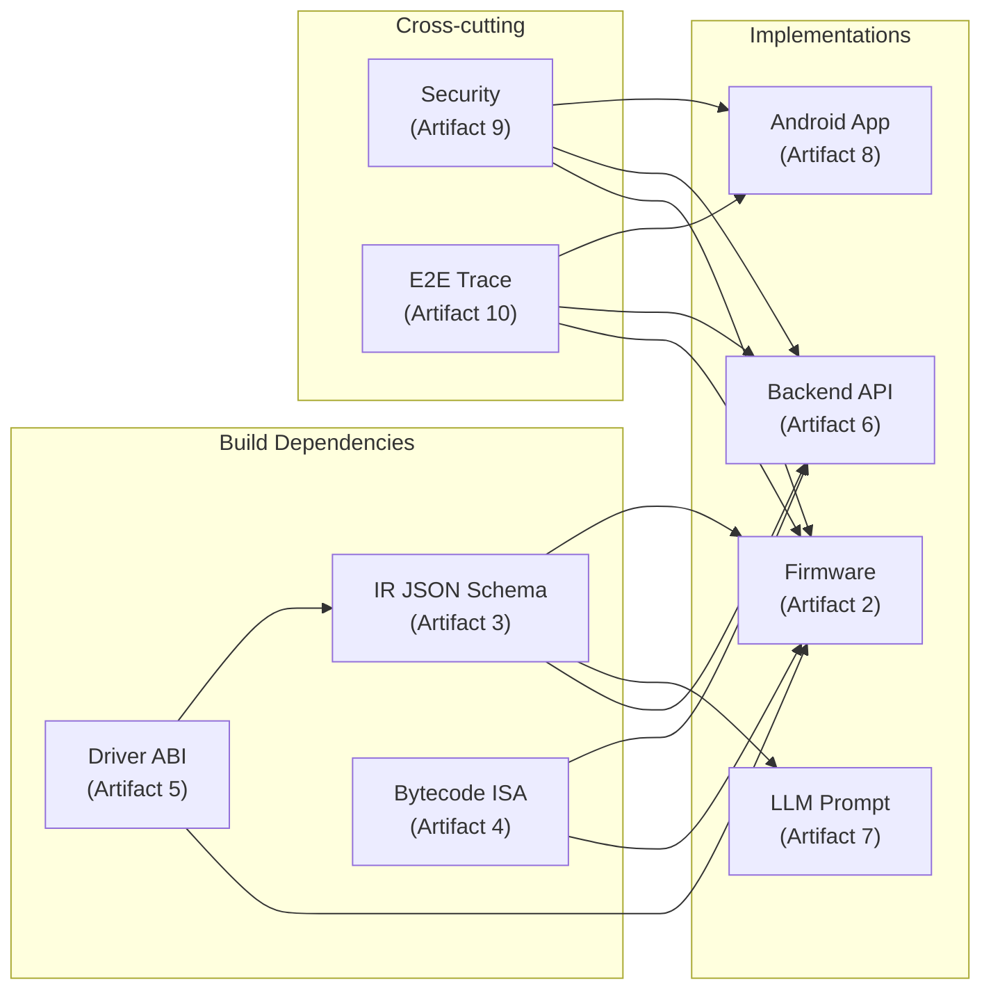

# Artifact 1 — Architecture Diagram

## Parakram System Architecture — Complete

---

## 1. High-Level System Topology

```
┌─────────────────────────────────────────────────────────────────────────────┐
│                              USER DOMAIN                                    │
│                                                                             │
│   ┌───────────────────────────┐         ┌────────────────────────────────┐  │
│   │   Android App (Parakram)  │◄───────►│   Laptop Backend (Rust/Axum)  │  │
│   │                           │  WiFi   │                                │  │
│   │  • Jetpack Compose UI     │  HTTP/  │  • IR Validator                │  │
│   │  • BLE GATT Client        │  WS     │  • Bytecode Compiler           │  │
│   │  • WiFi Deployment        │  JSON   │  • LLM Interface               │  │
│   │  • Telemetry Dashboard    │  JWT    │  • Device Registry (SQLite)    │  │
│   │                           │         │  • Crypto Signer (Ed25519)     │  │
│   └───────────┬───────────────┘         └──────────┬─────────────────────┘  │
│               │                                     │                       │
│               │ BLE GATT                            │ HTTPS (reqwest)       │
│               │ (config push,                       │ JSON                  │
│               │  telemetry notify)                  │ API Key               │
│               │                                     │                       │
│   ┌───────────▼───────────────┐         ┌──────────▼─────────────────────┐  │
│   │   ESP32-S3 Device         │         │   OpenRouter LLM API           │  │
│   │                           │         │                                │  │
│   │  • Bytecode VM            │         │  • Mixtral-8x7B / Gemma-2-9B   │  │
│   │  • Driver Layer           │         │  • Structured JSON output      │  │
│   │  • Event Bus              │         │  • Feasibility + IR Gen        │  │
│   │  • Safety Layer           │         │                                │  │
│   │  • Secure Boot V2         │         └────────────────────────────────┘  │
│   │  • Flash Encryption       │                                             │
│   └───────────────────────────┘                                             │
│                                                                             │
└─────────────────────────────────────────────────────────────────────────────┘
```

---

## 2. Detailed Layer Interaction Diagram



---

## 3. Data Flow Annotations — Every Arrow

### 3.1 Android App → Local Backend

| Path | Protocol | Direction | Data Format | Auth |
|------|----------|-----------|-------------|------|
| NL Intent | HTTP POST `/api/llm/intent` | App → Backend | `{"description": "...", "board_id": "..."}` JSON | JWT Bearer token (24h expiry) |
| IR Validate | HTTP POST `/api/ir/validate` | App → Backend | IR JSON body | JWT Bearer token |
| IR Compile | HTTP POST `/api/ir/compile` | App → Backend | IR JSON body | JWT Bearer token |
| Deploy | HTTP POST `/api/ir/deploy/:device_id` | App → Backend | `{"bytecode_b64": "...", "device_id": "..."}` | JWT Bearer token |
| Project CRUD | HTTP GET/POST `/api/projects` | Bidirectional | Project JSON | JWT Bearer token |
| Device List | HTTP GET `/api/devices` | Backend → App | Device JSON array | JWT Bearer token |
| Telemetry Stream | WebSocket `/api/devices/:id/telemetry` | Backend → App | JSON frames: `{"ts": ..., "pipeline": "...", "values": {...}}` | JWT on upgrade |

### 3.2 Local Backend → OpenRouter LLM

| Path | Protocol | Direction | Data Format | Auth |
|------|----------|-----------|-------------|------|
| Feasibility Check | HTTPS POST `openrouter.ai/api/v1/chat/completions` | Backend → LLM | `{"messages": [...], "response_format": {"type": "json_object"}}` | `Authorization: Bearer <api_key>` |
| IR Generation | HTTPS POST (same) | Backend → LLM | Same structure, augmented prompt | Same |
| Response | HTTPS 200 | LLM → Backend | `{"choices": [{"message": {"content": "<IR JSON>"}}]}` | N/A |

### 3.3 Android App → ESP32-S3 Device

| Path | Protocol | Direction | Data Format | Auth |
|------|----------|-----------|-------------|------|
| BLE Discovery | BLE 5.0 Advertising | Device → App | Advertising packet: manufacturer data with Vidyuthlabs ID (0xVDYT) | None (discovery) |
| BLE Pairing | BLE GATT Connect | Bidirectional | GATT Service Discovery | BLE Bonding (LE Secure Connections, numeric comparison) |
| Config Push (BLE) | BLE GATT Write (Config Service) | App → Device | Chunked: `[seq:2B][total_chunks:2B][payload_chunk:508B]` | Payload is Ed25519-signed bytecode |
| Config Push (WiFi) | TCP socket, port 8423 | App → Device | Framed: `[magic:4B "PRKM"][version:2B][length:4B][payload][crc32:4B]` | Payload is Ed25519-signed bytecode |
| Config ACK | BLE GATT Notify / TCP response | Device → App | `[status:1B][error_code:2B][program_id:16B]` | Implicit (bonded/connected) |
| Telemetry | BLE GATT Notify (Telemetry Service) | Device → App | `[pipeline_id:1B][tick:4B][num_values:1B][value_entries:variable]` | Implicit (bonded) |
| Status | BLE GATT Read (Status Service) | App → Device (read) | `[state:1B][uptime_s:4B][fw_ver:4B][error_count:2B][active_pipelines:1B]` | Implicit (bonded) |

### 3.4 Device Internal Data Flow

| Path | Mechanism | Data Format |
|------|-----------|-------------|
| Bytecode → VM | Direct memory read (flash-mapped) | 8-byte instructions, sequential |
| VM → Driver | Static dispatch table call | `driver_vtable_t.read()` / `.write()` with typed values |
| Driver → Event Bus | `event_bus_publish()` | Ring buffer entry: `[event_type:1B][source_id:1B][timestamp:4B][value:8B]` |
| Event Bus → Scheduler | `event_bus_subscribe()` callback | Same ring buffer entry |
| Scheduler → VM | Task resume (FreeRTOS `xTaskNotify`) | Pipeline index as notification value |
| VM → State Store | `state_store_set()` | Index + typed value union |
| Safety → VM | Watchdog interrupt / abort injection | `ABORT` opcode injected at current PC |
| Comms → MQTT | `mqtt_client_publish()` | Topic string (const pool) + payload bytes |
| Comms → SD | `log_sd_write()` | CSV row: `timestamp,pipeline_id,field1,field2,...` |

---

## 4. Security Boundary Diagram

```
┌────────────────────────────────────────────────────────────┐
│                    TRUST BOUNDARY 1                         │
│              (Laptop — physically controlled)               │
│                                                             │
│    ┌──────────────────┐      ┌─────────────────────┐       │
│    │   Android App    │      │   Local Backend      │       │
│    │                  │◄────►│                      │       │
│    │  Stores: JWT     │ WiFi │  Stores:             │       │
│    │  No secrets      │ LAN  │  • Backend signing   │       │
│    │                  │      │    key (OS keychain)  │       │
│    └────────┬─────────┘      │  • Device pubkeys    │       │
│             │                │  • User sessions     │       │
│             │ BLE            └─────────┬────────────┘       │
│             │                          │ HTTPS              │
│ ┌───────────▼────────────┐             │                    │
│ │    TRUST BOUNDARY 2    │    ┌────────▼────────────┐       │
│ │  (Device — tamper-     │    │  TRUST BOUNDARY 3   │       │
│ │   resistant via        │    │  (External — LLM    │       │
│ │   secure boot)         │    │   API, untrusted    │       │
│ │                        │    │   output)            │       │
│ │  Stores:               │    │                     │       │
│ │  • Device keypair      │    │  LLM output is      │       │
│ │    (eFuse, read-only)  │    │  ALWAYS validated    │       │
│ │  • Backend verify key  │    │  before use          │       │
│ │    (eFuse, read-only)  │    └─────────────────────┘       │
│ │  • Bound user_id       │                                  │
│ │    (encrypted NVS)     │                                  │
│ └────────────────────────┘                                  │
└────────────────────────────────────────────────────────────┘
```

---

## 5. Protocol Stack Summary

```
┌──────────────────────────────────────────────────────┐
│ Application    │ IR JSON │ Bytecode │ Telemetry JSON │
├──────────────────────────────────────────────────────┤
│ Presentation   │ JSON    │ Binary   │ JSON           │
├──────────────────────────────────────────────────────┤
│ Session        │ JWT     │ Ed25519  │ JWT/BLE Bond   │
├──────────────────────────────────────────────────────┤
│ Transport      │ HTTP    │ TCP/GATT │ WS/GATT        │
├──────────────────────────────────────────────────────┤
│ Network        │ WiFi    │ WiFi/BLE │ WiFi/BLE       │
├──────────────────────────────────────────────────────┤
│ Physical       │ 802.11  │ 802.11   │ 802.15.1       │
│                │  n/ac   │  /BLE5   │  BLE5          │
└──────────────────────────────────────────────────────┘
```

---

## 6. Deployment Sequence Diagram



---

## 7. Component Dependency Map


