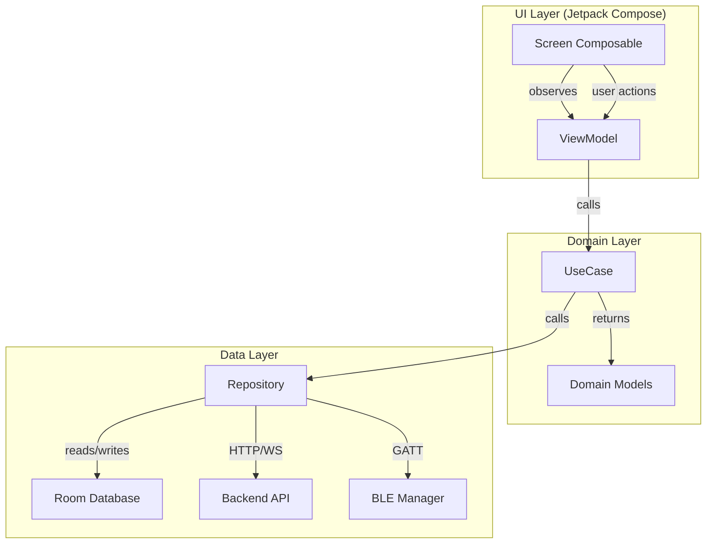
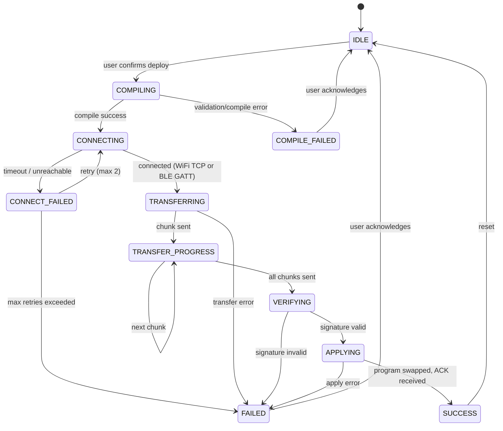

# Artifact 8 — Android Architecture

## 1. Package Structure

```
com.vidyuthlabs.parakram/
├── ParakramApplication.kt                    # Application class, DI initialization
├── di/
│   ├── AppModule.kt                         # Hilt module: singletons (DB, API, BLE)
│   ├── NetworkModule.kt                     # OkHttp client, Retrofit/backend API
│   └── RepositoryModule.kt                  # Repository bindings
│
├── data/
│   ├── local/
│   │   ├── ParakramDatabase.kt              # Room database (projects, devices, telemetry cache)
│   │   ├── dao/
│   │   │   ├── ProjectDao.kt               # Project CRUD operations
│   │   │   ├── DeviceDao.kt                # Device CRUD operations
│   │   │   └── TelemetryDao.kt             # Telemetry cache operations
│   │   └── entity/
│   │       ├── ProjectEntity.kt            # Room entity for projects
│   │       ├── DeviceEntity.kt             # Room entity for paired devices
│   │       └── TelemetryEntity.kt          # Room entity for cached telemetry
│   │
│   ├── remote/
│   │   ├── BackendApi.kt                    # Retrofit interface for backend REST API
│   │   ├── WebSocketClient.kt               # OkHttp WebSocket for telemetry streams
│   │   ├── dto/
│   │   │   ├── ProjectDto.kt               # API data transfer objects
│   │   │   ├── IRDocumentDto.kt            # IR JSON DTO
│   │   │   ├── ValidationResultDto.kt      # Validation result DTO
│   │   │   ├── CompileResultDto.kt         # Compilation result DTO
│   │   │   ├── IntentRequestDto.kt         # LLM intent request DTO
│   │   │   ├── IntentResponseDto.kt        # LLM intent response DTO
│   │   │   ├── DeviceDto.kt               # Device DTO
│   │   │   ├── TelemetryFrameDto.kt       # Telemetry frame DTO
│   │   │   ├── DriverSpecDto.kt           # Driver specification DTO
│   │   │   ├── BoardDescriptorDto.kt      # Board descriptor DTO
│   │   │   └── AuthDto.kt                 # Login/token DTOs
│   │   └── interceptor/
│   │       └── AuthInterceptor.kt          # JWT token injection into requests
│   │
│   ├── ble/
│   │   ├── BleManager.kt                    # BLE scan, connect, disconnect lifecycle
│   │   ├── BleGattCallback.kt               # GATT event handling
│   │   ├── BleDeviceScanner.kt              # Scan for Vidyuthlabs devices (manufacturer ID filter)
│   │   ├── BleConfigTransfer.kt             # Chunked bytecode transfer over GATT
│   │   ├── BleTelemetryReceiver.kt          # Telemetry characteristic notification handler
│   │   ├── BleConstants.kt                  # UUID constants, MTU, manufacturer ID
│   │   └── BleChunkProtocol.kt              # Chunk sequencing, reassembly, ACK logic
│   │
│   └── repository/
│       ├── ProjectRepository.kt             # Project data operations (local + remote)
│       ├── DeviceRepository.kt              # Device management (BLE + backend)
│       ├── TelemetryRepository.kt           # Telemetry streaming and history
│       ├── IRRepository.kt                  # IR validation, compilation, deployment
│       ├── LLMRepository.kt                 # NL intent processing
│       ├── DriverRepository.kt              # Driver registry queries
│       └── AuthRepository.kt               # Authentication, token management
│
├── domain/
│   ├── model/
│   │   ├── Project.kt                       # Domain model for projects
│   │   ├── Device.kt                        # Domain model for devices
│   │   ├── DeviceStatus.kt                  # Enum: Online, Offline, Deploying, Error
│   │   ├── IRDocument.kt                    # Domain model for IR
│   │   ├── IRPreview.kt                     # Plain-English preview of IR
│   │   ├── Pipeline.kt                      # Pipeline summary for display
│   │   ├── TelemetryPoint.kt               # Single telemetry data point
│   │   ├── ValidationResult.kt             # Validation state
│   │   ├── DeploymentState.kt              # Deployment FSM state
│   │   ├── DriverSpec.kt                   # Driver info for display
│   │   └── BoardDescriptor.kt             # Board info
│   │
│   └── usecase/
│       ├── ProcessIntentUseCase.kt          # NL → feasibility → IR → validate
│       ├── DeployProjectUseCase.kt          # Compile → transfer → verify
│       ├── PairDeviceUseCase.kt             # BLE scan → pair → register
│       ├── StreamTelemetryUseCase.kt        # WebSocket + BLE telemetry merge
│       └── ValidateIRUseCase.kt             # IR validation wrapper
│
├── ui/
│   ├── theme/
│   │   ├── Color.kt                         # Color palette
│   │   ├── Typography.kt                   # Font families and text styles
│   │   ├── Shape.kt                        # Corner radii, shapes
│   │   └── Theme.kt                        # Material3 theme (dark + light)
│   │
│   ├── navigation/
│   │   ├── NavGraph.kt                      # Navigation graph definition
│   │   ├── Screen.kt                        # Screen route sealed class
│   │   └── BottomNavBar.kt                  # Bottom navigation composable
│   │
│   ├── splash/
│   │   ├── SplashScreen.kt                  # Animated splash with Vidyuthlabs branding
│   │   └── OnboardingScreen.kt             # First-time user onboarding flow
│   │
│   ├── discovery/
│   │   ├── DeviceDiscoveryScreen.kt         # BLE scan UI with auto-detect
│   │   ├── DeviceDiscoveryViewModel.kt      # Scan state, device list, pair action
│   │   └── DeviceCard.kt                    # Individual discovered device card
│   │
│   ├── projects/
│   │   ├── ProjectHomeScreen.kt             # Project list for selected device
│   │   ├── ProjectHomeViewModel.kt          # Project CRUD, device filter
│   │   ├── ProjectCard.kt                   # Single project card composable
│   │   └── CreateProjectDialog.kt           # New project dialog
│   │
│   ├── templates/
│   │   ├── TemplateBrowserScreen.kt         # Categorized template grid
│   │   ├── TemplateBrowserViewModel.kt      # Template fetch, filter, select
│   │   ├── TemplateCard.kt                  # Template preview card
│   │   └── TemplateDetailSheet.kt           # Template detail bottom sheet
│   │
│   ├── builder/
│   │   ├── NaturalLanguageScreen.kt         # Text input → preview → deploy
│   │   ├── NaturalLanguageViewModel.kt      # Intent processing, preview state
│   │   ├── IRPreviewCard.kt                 # Plain-English IR preview
│   │   ├── FeasibilityResultCard.kt         # Feasibility check display
│   │   └── SuggestionChips.kt              # Alternative suggestions from LLM
│   │
│   ├── editor/
│   │   ├── ProjectEditorScreen.kt           # Visual behavior builder
│   │   ├── ProjectEditorViewModel.kt        # Node editing, IR manipulation
│   │   ├── TriggerCard.kt                   # Trigger configuration card
│   │   ├── ConditionCard.kt                 # Condition node card
│   │   ├── ActionCard.kt                    # Action node card
│   │   └── PipelineFlow.kt                  # Visual pipeline flow layout
│   │
│   ├── dashboard/
│   │   ├── LiveDashboardScreen.kt           # Real-time telemetry display
│   │   ├── LiveDashboardViewModel.kt        # Telemetry stream, chart data
│   │   ├── SensorGauge.kt                   # Circular gauge for sensor values
│   │   ├── PipelineStatusCard.kt            # Active pipeline status indicator
│   │   ├── TelemetryChart.kt                # Real-time line chart
│   │   └── ErrorBanner.kt                   # Error indicator composable
│   │
│   ├── settings/
│   │   ├── DeviceSettingsScreen.kt          # Device info, rename, unpair
│   │   ├── DeviceSettingsViewModel.kt       # Settings operations
│   │   └── FirmwareInfoCard.kt             # Firmware version, uptime display
│   │
│   └── common/
│       ├── LoadingOverlay.kt                # Full-screen loading composable
│       ├── ErrorDialog.kt                   # Error display dialog
│       ├── DeploymentProgress.kt            # Deployment progress indicator
│       ├── StatusBadge.kt                   # Online/offline status badge
│       └── UnitFormatter.kt                # Value + unit formatting (28.4°C, etc.)
│
└── util/
    ├── extensions/
    │   ├── FlowExtensions.kt               # Kotlin Flow utilities
    │   └── ByteArrayExtensions.kt          # Base64, hex, chunking
    ├── Constants.kt                         # App-wide constants
    └── Logger.kt                            # Logging wrapper
```

---

## 2. ViewModel / Repository Pattern

### Architecture Diagram



### Example: NaturalLanguageViewModel

```kotlin
@HiltViewModel
class NaturalLanguageViewModel @Inject constructor(
    private val processIntentUseCase: ProcessIntentUseCase,
    private val deployProjectUseCase: DeployProjectUseCase,
    private val deviceRepository: DeviceRepository,
) : ViewModel() {

    // UI State
    private val _uiState = MutableStateFlow(NLBuilderUiState())
    val uiState: StateFlow<NLBuilderUiState> = _uiState.asStateFlow()

    // Events (one-shot)
    private val _events = Channel<NLBuilderEvent>(Channel.BUFFERED)
    val events: Flow<NLBuilderEvent> = _events.receiveAsFlow()

    fun onDescriptionChanged(text: String) {
        _uiState.update { it.copy(description = text) }
    }

    fun onSubmitIntent() {
        val state = _uiState.value
        if (state.description.isBlank()) return

        viewModelScope.launch {
            _uiState.update { it.copy(phase = NLPhase.CHECKING_FEASIBILITY) }

            processIntentUseCase(
                description = state.description,
                boardId = state.selectedDevice?.boardSku ?: return@launch,
                deviceId = state.selectedDevice?.id,
            ).fold(
                onSuccess = { result ->
                    _uiState.update {
                        it.copy(
                            phase = NLPhase.PREVIEW,
                            irPreview = result.preview,
                            irDocument = result.ir,
                            validation = result.validation,
                        )
                    }
                },
                onFailure = { error ->
                    when (error) {
                        is NotFeasibleException -> {
                            _uiState.update {
                                it.copy(
                                    phase = NLPhase.NOT_FEASIBLE,
                                    feasibilityReason = error.reason,
                                    suggestions = error.suggestions,
                                )
                            }
                        }
                        is RateLimitException -> {
                            _events.send(NLBuilderEvent.ShowError("Rate limit exceeded. Try again in ${error.retryAfterSecs}s."))
                            _uiState.update { it.copy(phase = NLPhase.INPUT) }
                        }
                        else -> {
                            _events.send(NLBuilderEvent.ShowError(error.message ?: "Unknown error"))
                            _uiState.update { it.copy(phase = NLPhase.INPUT) }
                        }
                    }
                }
            )
        }
    }

    fun onConfirmDeploy() {
        val state = _uiState.value
        val ir = state.irDocument ?: return
        val device = state.selectedDevice ?: return

        viewModelScope.launch {
            _uiState.update { it.copy(phase = NLPhase.DEPLOYING, deploymentState = DeploymentState.COMPILING) }

            deployProjectUseCase(ir, device).collect { deployState ->
                _uiState.update { it.copy(deploymentState = deployState) }

                when (deployState) {
                    DeploymentState.SUCCESS -> {
                        _uiState.update { it.copy(phase = NLPhase.DEPLOYED) }
                        _events.send(NLBuilderEvent.DeploymentSuccess)
                    }
                    is DeploymentState.FAILED -> {
                        _uiState.update { it.copy(phase = NLPhase.PREVIEW) }
                        _events.send(NLBuilderEvent.ShowError("Deployment failed: ${deployState.reason}"))
                    }
                    else -> { /* Progress updates handled by state observation */ }
                }
            }
        }
    }
}

data class NLBuilderUiState(
    val description: String = "",
    val selectedDevice: Device? = null,
    val phase: NLPhase = NLPhase.INPUT,
    val irPreview: IRPreview? = null,
    val irDocument: IRDocument? = null,
    val validation: ValidationResult? = null,
    val feasibilityReason: String? = null,
    val suggestions: List<String> = emptyList(),
    val deploymentState: DeploymentState = DeploymentState.IDLE,
)

enum class NLPhase {
    INPUT,
    CHECKING_FEASIBILITY,
    NOT_FEASIBLE,
    PREVIEW,
    DEPLOYING,
    DEPLOYED,
}

sealed class NLBuilderEvent {
    data class ShowError(val message: String) : NLBuilderEvent()
    data object DeploymentSuccess : NLBuilderEvent()
}
```

---

## 3. BLE GATT Service / Characteristic UUID Table

### Service UUIDs

| Service | UUID | Description |
|---------|------|-------------|
| Parakram Config Service | `F47AC10B-58CC-4372-A567-0E02B2C3D479` | Write signed bytecode payloads to device |
| Parakram Telemetry Service | `F47AC10B-58CC-4372-A567-0E02B2C3D480` | Subscribe to live telemetry notifications |
| Parakram Status Service | `F47AC10B-58CC-4372-A567-0E02B2C3D481` | Read device status, errors, uptime |
| Device Information Service | `0000180A-0000-1000-8000-00805F9B34FB` | Standard BLE DIS (manufacturer, model, firmware) |

### Characteristic UUIDs — Config Service

| Characteristic | UUID | Properties | Description |
|----------------|------|------------|-------------|
| Config Payload | `F47AC10B-58CC-4372-A567-1001B2C3D479` | Write | Write bytecode chunk: `[seq:2B][total:2B][data:508B]` |
| Config Status | `F47AC10B-58CC-4372-A567-1002B2C3D479` | Read, Notify | Deployment status: `[state:1B][error:2B][program_id:16B]` |
| Config Control | `F47AC10B-58CC-4372-A567-1003B2C3D479` | Write | Control: `0x01`=start transfer, `0x02`=abort, `0x03`=verify |

### Config Status States

| Value | State | Description |
|-------|-------|-------------|
| 0x00 | IDLE | No deployment in progress |
| 0x01 | RECEIVING | Chunks being received |
| 0x02 | VERIFYING | Signature verification in progress |
| 0x03 | APPLYING | Atomic program swap |
| 0x04 | SUCCESS | Deployment complete |
| 0x80 | ERR_SIGNATURE | Signature verification failed |
| 0x81 | ERR_INCOMPLETE | Missing chunks |
| 0x82 | ERR_CRC | CRC mismatch |
| 0x83 | ERR_SIZE | Payload too large |
| 0x84 | ERR_INTERNAL | Internal error during apply |

### Characteristic UUIDs — Telemetry Service

| Characteristic | UUID | Properties | Description |
|----------------|------|------------|-------------|
| Pipeline 0 Data | `F47AC10B-58CC-4372-A567-2000B2C3D480` | Notify | Pipeline 0 telemetry |
| Pipeline 1 Data | `F47AC10B-58CC-4372-A567-2001B2C3D480` | Notify | Pipeline 1 telemetry |
| Pipeline 2 Data | `F47AC10B-58CC-4372-A567-2002B2C3D480` | Notify | Pipeline 2 telemetry |
| Pipeline 3 Data | `F47AC10B-58CC-4372-A567-2003B2C3D480` | Notify | Pipeline 3 telemetry |
| Pipeline 4 Data | `F47AC10B-58CC-4372-A567-2004B2C3D480` | Notify | Pipeline 4 telemetry |
| Pipeline 5 Data | `F47AC10B-58CC-4372-A567-2005B2C3D480` | Notify | Pipeline 5 telemetry |
| Pipeline 6 Data | `F47AC10B-58CC-4372-A567-2006B2C3D480` | Notify | Pipeline 6 telemetry |
| Pipeline 7 Data | `F47AC10B-58CC-4372-A567-2007B2C3D480` | Notify | Pipeline 7 telemetry |
| Pipeline 8-15   | `...2008` – `...200F`                    | Notify | Pipelines 8-15 |
| Aggregate Data  | `F47AC10B-58CC-4372-A567-20FFB2C3D480` | Notify | Aggregated all-pipeline snapshot |

### Telemetry Notification Format

```
Byte 0:     pipeline_id (uint8)
Byte 1-4:   tick (uint32, ms since pipeline start)
Byte 5:     num_values (uint8, max 8)
Byte 6+:    value entries, each:
              Byte 0: variable_index (uint8)
              Byte 1: type (0=int, 1=float, 2=bool)
              Byte 2-5: value (4 bytes, type-dependent)
```

Max notification payload: 6 + (8 × 6) = 54 bytes (well within BLE 5.0 MTU)

### Characteristic UUIDs — Status Service

| Characteristic | UUID | Properties | Description |
|----------------|------|------------|-------------|
| Device State | `F47AC10B-58CC-4372-A567-3001B2C3D481` | Read | `[state:1B][active_pipelines:1B][error_count:2B]` |
| Uptime | `F47AC10B-58CC-4372-A567-3002B2C3D481` | Read | `[uptime_seconds:4B]` (uint32) |
| Firmware Version | `F47AC10B-58CC-4372-A567-3003B2C3D481` | Read | `[major:1B][minor:1B][patch:1B][build:1B]` |
| Error Log | `F47AC10B-58CC-4372-A567-3004B2C3D481` | Read | Last 5 errors: `[count:1B][entries×5:[code:2B][tick:4B]]` |
| Active Program | `F47AC10B-58CC-4372-A567-3005B2C3D481` | Read | `[has_program:1B][program_id:16B]` |

### BLE Constants

```kotlin
// BleConstants.kt
object BleConstants {
    // Vidyuthlabs manufacturer ID in BLE advertisement
    const val MANUFACTURER_ID = 0x0D17  // "VDYT" compressed

    // MTU
    const val PREFERRED_MTU = 517
    const val CHUNK_SIZE = 508          // MTU - 3 (ATT header) - 4 (seq + total) - 2 (overhead)

    // Timeouts
    const val SCAN_TIMEOUT_MS = 15_000L
    const val CONNECT_TIMEOUT_MS = 10_000L
    const val CHUNK_WRITE_TIMEOUT_MS = 5_000L
    const val DEPLOY_TOTAL_TIMEOUT_MS = 60_000L

    // Retries
    const val MAX_CHUNK_RETRIES = 3
    const val MAX_CONNECT_RETRIES = 2
}
```

---

## 4. Deployment State Machine

### States

| State | Description |
|-------|-------------|
| `IDLE` | No deployment in progress |
| `COMPILING` | Backend is validating IR and compiling bytecode |
| `COMPILE_FAILED` | Validation or compilation failed |
| `CONNECTING` | Establishing connection to device (WiFi or BLE) |
| `CONNECT_FAILED` | Cannot reach device |
| `TRANSFERRING` | Sending bytecode payload to device |
| `TRANSFER_PROGRESS(percent)` | Transfer in progress with percentage |
| `VERIFYING` | Device is verifying signature |
| `APPLYING` | Device is applying new program |
| `SUCCESS` | Deployment complete, program running |
| `FAILED(reason)` | Deployment failed at some stage |

### State Machine Diagram



### Transition Guards

| Transition | Guard Condition |
|------------|----------------|
| IDLE → COMPILING | IR document not null, device selected |
| COMPILING → CONNECTING | `CompileResult` received with valid bytecode |
| CONNECTING → TRANSFERRING | TCP connection established OR BLE GATT connected + MTU negotiated |
| CONNECT_FAILED → CONNECTING | retry count < `MAX_CONNECT_RETRIES` |
| TRANSFERRING → VERIFYING | All chunks ACKed (BLE) or full payload sent (WiFi) |
| VERIFYING → APPLYING | Config Status characteristic = `0x03` (APPLYING) |
| APPLYING → SUCCESS | Config Status characteristic = `0x04` (SUCCESS) within 5s |

### Kotlin Implementation

```kotlin
sealed class DeploymentState {
    data object IDLE : DeploymentState()
    data object COMPILING : DeploymentState()
    data class COMPILE_FAILED(val errors: List<ValidationError>) : DeploymentState()
    data object CONNECTING : DeploymentState()
    data class CONNECT_FAILED(val attempt: Int, val maxAttempts: Int) : DeploymentState()
    data class TRANSFERRING(val method: TransferMethod) : DeploymentState()
    data class TRANSFER_PROGRESS(val percent: Int, val method: TransferMethod) : DeploymentState()
    data object VERIFYING : DeploymentState()
    data object APPLYING : DeploymentState()
    data object SUCCESS : DeploymentState()
    data class FAILED(val reason: String, val stage: String) : DeploymentState()

    enum class TransferMethod { WIFI, BLE }
}

class DeployProjectUseCase @Inject constructor(
    private val irRepository: IRRepository,
    private val deviceRepository: DeviceRepository,
    private val bleManager: BleManager,
) {
    operator fun invoke(ir: IRDocument, device: Device): Flow<DeploymentState> = flow {
        // 1. Compile
        emit(DeploymentState.COMPILING)
        val compileResult = irRepository.compile(ir, device.id)
            .getOrElse { e ->
                emit(DeploymentState.COMPILE_FAILED(
                    (e as? ValidationException)?.errors ?: emptyList()
                ))
                return@flow
            }

        // 2. Connect
        emit(DeploymentState.CONNECTING)
        val transferMethod = if (device.connectivity == Connectivity.WIFI || device.connectivity == Connectivity.BOTH) {
            DeploymentState.TransferMethod.WIFI
        } else {
            DeploymentState.TransferMethod.BLE
        }

        var connected = false
        for (attempt in 1..BleConstants.MAX_CONNECT_RETRIES) {
            connected = when (transferMethod) {
                DeploymentState.TransferMethod.WIFI ->
                    deviceRepository.connectWifi(device).isSuccess
                DeploymentState.TransferMethod.BLE ->
                    bleManager.connect(device.bleAddress!!).isSuccess
            }
            if (connected) break
            emit(DeploymentState.CONNECT_FAILED(attempt, BleConstants.MAX_CONNECT_RETRIES))
            delay(1000L * attempt)  // Exponential-ish backoff
        }
        if (!connected) {
            emit(DeploymentState.FAILED("Cannot connect to device", "CONNECTING"))
            return@flow
        }

        // 3. Transfer
        emit(DeploymentState.TRANSFERRING(transferMethod))
        val bytecodeBytes = Base64.decode(compileResult.bytecodeB64, Base64.DEFAULT)

        when (transferMethod) {
            DeploymentState.TransferMethod.WIFI -> {
                val result = deviceRepository.deployWifi(device, bytecodeBytes)
                if (result.isFailure) {
                    emit(DeploymentState.FAILED("WiFi transfer failed", "TRANSFERRING"))
                    return@flow
                }
                emit(DeploymentState.TRANSFER_PROGRESS(100, transferMethod))
            }
            DeploymentState.TransferMethod.BLE -> {
                val chunks = bytecodeBytes.chunked(BleConstants.CHUNK_SIZE)
                val totalChunks = chunks.size

                for ((index, chunk) in chunks.withIndex()) {
                    val success = bleManager.writeConfigChunk(
                        sequenceNumber = index,
                        totalChunks = totalChunks,
                        data = chunk.toByteArray(),
                    )
                    if (!success) {
                        emit(DeploymentState.FAILED("BLE chunk $index failed", "TRANSFERRING"))
                        return@flow
                    }
                    val percent = ((index + 1) * 100) / totalChunks
                    emit(DeploymentState.TRANSFER_PROGRESS(percent, transferMethod))
                }
            }
        }

        // 4. Verify + Apply (poll device status)
        emit(DeploymentState.VERIFYING)
        val startTime = System.currentTimeMillis()

        while (System.currentTimeMillis() - startTime < 10_000) {
            val status = when (transferMethod) {
                DeploymentState.TransferMethod.BLE ->
                    bleManager.readConfigStatus()
                DeploymentState.TransferMethod.WIFI ->
                    deviceRepository.pollDeployStatus(device)
            }

            when (status) {
                0x03 -> emit(DeploymentState.APPLYING)  // APPLYING
                0x04 -> {
                    emit(DeploymentState.SUCCESS)
                    return@flow
                }
                in 0x80..0xFF -> {
                    val errorMsg = when (status) {
                        0x80 -> "Signature verification failed"
                        0x81 -> "Incomplete payload"
                        0x82 -> "CRC mismatch"
                        0x83 -> "Payload too large"
                        else -> "Device error: 0x${status.toString(16)}"
                    }
                    emit(DeploymentState.FAILED(errorMsg, "VERIFYING"))
                    return@flow
                }
            }
            delay(500)
        }

        emit(DeploymentState.FAILED("Verification timeout", "VERIFYING"))
    }
}
```

---

## 5. Screen Wireframe Descriptions

### 5.1 Splash / Onboarding

- Full-screen Vidyuthlabs logo animation (Lottie)
- Gradient background (brand colors)
- First-time: 3-step onboarding carousel
  1. "Welcome to Parakram" — product overview
  2. "Plug in your board" — hardware setup illustration
  3. "Describe what you want" — NL input demo
- "Get Started" button → Device Discovery

### 5.2 Device Discovery

- Top: "Looking for devices..." with pulsing BLE scan animation
- Card list of discovered devices, each showing:
  - Board name + SKU (e.g., "Vidyuthlabs S3 Rev 1")
  - Signal strength indicator (RSSI bars)
  - "Pair" button
- Bottom: "Scanning..." status with cancel option
- Paired devices section (previously paired, auto-reconnect)

### 5.3 Project Home

- Top bar: Selected device name + status badge (green=online)
- Grid of project cards, each showing:
  - Project name
  - Last deployed date
  - Active pipeline count
  - Status indicator (running/stopped/error)
- FAB: "+" to create new project
- Menu options: Templates, Natural Language Builder

### 5.4 Template Browser

- Category tabs: Environment | Motion | Data Logging | Automation | Safety | Agriculture | Display
- Card grid per category, each showing:
  - Template name + difficulty badge
  - One-sentence description
  - Required sensors/actuators icons
  - "Use Template" button
- Tapping shows TemplateDetailSheet with full description + IR preview

### 5.5 Natural Language Builder

- Text area: "Describe what you want your device to do..."
- Submit button → shows loading state
- Result states:
  - **Feasible**: Shows plain-English preview cards (triggers, conditions, actions)
    - "Deploy" button at bottom
  - **Not feasible**: Shows reason + suggestion chips
- Deployment progress overlay (see state machine above)

### 5.6 Project Editor

- Visual node canvas
- Left panel: Available triggers (drag to add)
- Center: Pipeline flow (trigger → condition → action cards, connected by lines)
- Right panel: Node properties (tap a card to configure)
- Bottom: "Validate" button, "Deploy" button
- No code visible — all cards use plain English

### 5.7 Live Dashboard

- Top: Device name + uptime + connection type badge
- Grid of sensor gauges (circular, animated):
  - Temperature: 28.4°C (with range arc)
  - Humidity: 65.2% (with range arc)
  - etc.
- Pipeline status cards:
  - Pipeline name + trigger description
  - "Running" / "Stopped" badge
  - Last execution time
  - Error indicator (if any)
- Real-time chart (last 60 data points, scrolling)
- Error banner at top if any pipeline has errors

### 5.8 Device Settings

- Device info card: Name, SKU, firmware version, BLE address, IP
- Uptime display
- "Rename Device" button
- "Factory Reset" button (with confirmation dialog)
- "Unpair" button (with confirmation)
- Active program info: program ID, deployed at, pipeline count
- Error log: last 5 errors with timestamps
